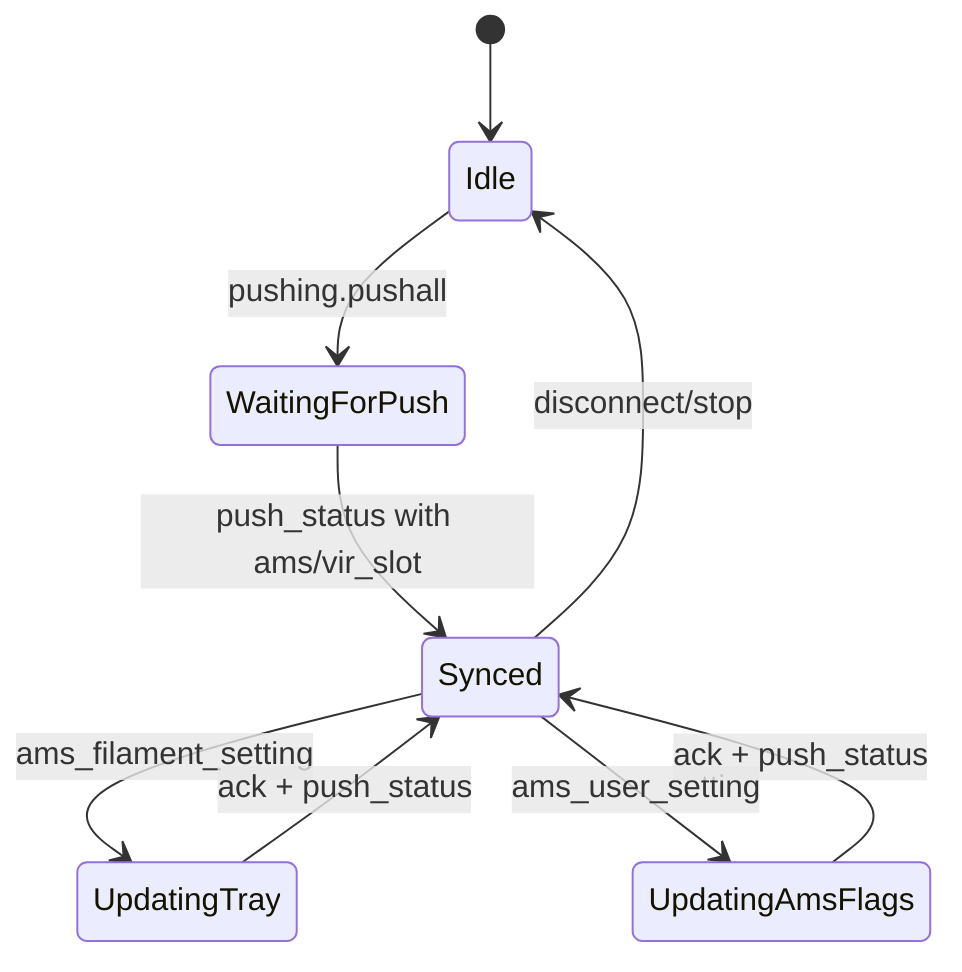

# sync_ams_list Protocol Spec

## Scope
This document specifies the communication protocol used by the sync_ams_list feature in OrcaSlicer.
It focuses on the LAN JSON messages that provide AMS/virtual tray data and the tray update command
used to sync filament metadata. The newest log also shows related AMS settings updates that can
influence how tray data is read.

## Data flow overview
The sync_ams_list UI does not call network APIs directly. It consumes printer state populated by
`MachineObject::parse_json()` and `DevFilaSystemParser::ParseV1_0()` and then builds a local
`filament_ams_list` via `Sidebar::build_filament_ams_list()`.

## Sequence diagram
```mermaid
sequenceDiagram
  participant UI as OrcaSlicer UI
  participant Agent as NetworkAgent
  participant Printer as Bambu Printer

  UI->>Agent: publish pushing.pushall
  Agent->>Printer: pushing.pushall
  Printer-->>Agent: print.push_status (ams + vir_slot)
  Agent-->>UI: OnMessageFn(payload)
  UI->>UI: parse_json -> DevFilaSystem -> build_filament_ams_list
  UI->>User: Sync AMS dialog (mapping)

  alt user updates tray metadata
    UI->>Agent: print.ams_filament_setting
    Agent->>Printer: print.ams_filament_setting
    Printer-->>Agent: print.ams_filament_setting (result)
    Printer-->>Agent: print.push_status (updated ams)
  end

  alt user updates AMS read settings
    UI->>Agent: print.ams_user_setting
    Agent->>Printer: print.ams_user_setting
    Printer-->>Agent: print.ams_user_setting (result)
    Printer-->>Agent: print.push_status (observed; flag propagation unverified)
  end
```

## State diagram


## JSON schemas
The schemas below describe the fields required for sync_ams_list. Other fields may be present
in the same payloads and are allowed via `additionalProperties: true`.

### 1) pushing.pushall (request)
```json
{
  "$schema": "https://json-schema.org/draft/2020-12/schema",
  "title": "pushing.pushall request",
  "type": "object",
  "required": ["pushing"],
  "properties": {
    "pushing": {
      "type": "object",
      "required": ["command", "sequence_id", "version", "push_target"],
      "properties": {
        "command": { "const": "pushall" },
        "sequence_id": { "type": "string" },
        "version": { "type": "integer" },
        "push_target": { "type": "integer" }
      },
      "additionalProperties": true
    }
  },
  "additionalProperties": true
}
```

### 2) print.push_status (AMS/virtual tray subset)
```json
{
  "$schema": "https://json-schema.org/draft/2020-12/schema",
  "title": "print.push_status (sync_ams_list subset)",
  "type": "object",
  "required": ["print"],
  "properties": {
    "print": {
      "type": "object",
      "required": ["command", "ams"],
      "properties": {
        "command": { "const": "push_status" },
        "sequence_id": { "type": "string" },
        "msg": { "type": "integer", "description": "Optional diff flag (0=full, 1=diff)." },
        "ams": { "$ref": "#/$defs/AmsBlock" },
        "vir_slot": {
          "type": "array",
          "description": "Virtual/external spool trays (id 254/255).",
          "items": { "$ref": "#/$defs/AmsTray" }
        },
        "vt_tray": {
          "type": "object",
          "description": "Alternate single virtual tray payload (observed in code, not in log).",
          "additionalProperties": true
        }
      },
      "additionalProperties": true
    }
  },
  "$defs": {
    "AmsBlock": {
      "type": "object",
      "required": ["ams"],
      "properties": {
        "ams": {
          "type": "array",
          "items": { "$ref": "#/$defs/AmsUnit" }
        },
        "ams_exist_bits": { "type": "string", "description": "Hex bitfield string." },
        "ams_exist_bits_raw": { "type": "string", "description": "Raw hex bitfield string." },
        "tray_exist_bits": { "type": "string", "description": "Hex bitfield string." },
        "tray_is_bbl_bits": { "type": "string", "description": "Hex bitfield string." },
        "tray_read_done_bits": { "type": "string" },
        "tray_reading_bits": { "type": "string" },
        "tray_now": { "type": "string" },
        "tray_pre": { "type": "string" },
        "tray_tar": { "type": "string" },
        "cali_id": { "type": "integer" },
        "cali_stat": { "type": "integer" },
        "insert_flag": { "type": "boolean" },
        "power_on_flag": { "type": "boolean" },
        "version": { "type": "integer" },
        "unbind_ams_stat": { "type": "integer" }
      },
      "additionalProperties": true
    },
    "AmsUnit": {
      "type": "object",
      "required": ["id", "tray"],
      "properties": {
        "id": { "type": "string" },
        "info": { "type": "string", "description": "Bitfield string: type and extruder id." },
        "dry_time": { "type": "integer" },
        "humidity": { "type": "string" },
        "humidity_raw": { "type": "string" },
        "temp": { "type": "string" },
        "tray": {
          "type": "array",
          "items": { "$ref": "#/$defs/AmsTray" }
        }
      },
      "additionalProperties": true
    },
    "AmsTray": {
      "type": "object",
      "required": ["id"],
      "properties": {
        "id": { "type": "string" },
        "state": { "type": "integer" },
        "tag_uid": { "type": "string" },
        "tray_info_idx": { "type": "string" },
        "tray_type": { "type": "string" },
        "tray_color": { "type": "string", "description": "RGBA hex without #." },
        "tray_sub_brands": { "type": "string" },
        "tray_weight": { "type": "string" },
        "tray_diameter": { "type": "string" },
        "tray_temp": { "type": "string" },
        "tray_time": { "type": "string" },
        "bed_temp_type": { "type": "string" },
        "bed_temp": { "type": "string" },
        "nozzle_temp_min": { "type": "string" },
        "nozzle_temp_max": { "type": "string" },
        "tray_uuid": { "type": "string" },
        "xcam_info": { "type": "string" },
        "ctype": { "type": "integer" },
        "cols": {
          "type": "array",
          "items": { "type": "string" }
        },
        "remain": { "type": "integer" },
        "drying_temp": { "type": "string" },
        "drying_time": { "type": "string" },
        "total_len": { "type": "integer" },
        "cali_idx": { "type": "integer" },
        "setting_id": { "type": "string" },
        "k": { "type": "number" },
        "n": { "type": "number" }
      },
      "additionalProperties": true
    }
  },
  "additionalProperties": true
}
```

### 3) print.ams_filament_setting (request/response)
```json
{
  "$schema": "https://json-schema.org/draft/2020-12/schema",
  "title": "print.ams_filament_setting",
  "type": "object",
  "required": ["print"],
  "properties": {
    "print": {
      "type": "object",
      "required": ["command", "sequence_id", "ams_id", "slot_id", "tray_id", "tray_info_idx", "tray_type", "tray_color", "nozzle_temp_min", "nozzle_temp_max"],
      "properties": {
        "command": { "const": "ams_filament_setting" },
        "sequence_id": { "type": "string" },
        "ams_id": { "type": "integer" },
        "slot_id": { "type": "integer" },
        "tray_id": { "type": "integer" },
        "tray_info_idx": { "type": "string" },
        "setting_id": { "type": "string" },
        "tray_type": { "type": "string" },
        "tray_color": { "type": "string" },
        "nozzle_temp_min": { "type": "integer" },
        "nozzle_temp_max": { "type": "integer" },
        "result": { "type": "string" },
        "reason": { "type": "string" },
        "errno": { "type": "integer" },
        "is_from_mqtt": { "type": "boolean" }
      },
      "additionalProperties": true
    }
  },
  "additionalProperties": true
}
```

### 4) print.ams_user_setting (request/response)
```json
{
  "$schema": "https://json-schema.org/draft/2020-12/schema",
  "title": "print.ams_user_setting",
  "type": "object",
  "required": ["print"],
  "properties": {
    "print": {
      "type": "object",
      "required": ["command", "sequence_id"],
      "properties": {
        "command": { "const": "ams_user_setting" },
        "sequence_id": { "type": "string" },
        "ams_id": { "type": "integer", "description": "-1 indicates all AMS units" },
        "calibrate_remain_flag": { "type": "boolean" },
        "startup_read_option": { "type": "boolean" },
        "tray_read_option": { "type": "boolean" },
        "result": { "type": "string" },
        "reason": { "type": "string" },
        "errno": { "type": "integer" },
        "is_from_mqtt": { "type": "boolean" }
      },
      "additionalProperties": true
    }
  },
  "additionalProperties": true
}
```

## Example payloads

### print.push_status (trimmed to AMS/vir_slot)
```json
{
  "print": {
    "command": "push_status",
    "sequence_id": "20009",
    "ams": {
      "ams": [
        {
          "id": "0",
          "info": "1103",
          "humidity": "2",
          "humidity_raw": "28",
          "temp": "34.0",
          "dry_time": 0,
          "tray": [
            {
              "id": "0",
              "tray_info_idx": "GFB99",
              "tray_type": "ABS",
              "tray_color": "0D6284FF",
              "nozzle_temp_min": "240",
              "nozzle_temp_max": "280",
              "tag_uid": "0000000000000000",
              "ctype": 0,
              "cols": ["0D6284FF"],
              "remain": -1
            },
            { "id": "1", "state": 0 }
          ]
        }
      ],
      "ams_exist_bits": "21",
      "tray_exist_bits": "5",
      "tray_is_bbl_bits": "5",
      "tray_now": "255",
      "tray_pre": "255",
      "tray_tar": "255",
      "tray_read_done_bits": "5",
      "tray_reading_bits": "0",
      "cali_id": 255,
      "cali_stat": 0,
      "insert_flag": true,
      "power_on_flag": false,
      "version": 157118,
      "unbind_ams_stat": 0
    },
    "vir_slot": [
      {
        "id": "254",
        "tray_info_idx": "",
        "tray_type": "",
        "tray_color": "00000000",
        "nozzle_temp_min": "0",
        "nozzle_temp_max": "0",
        "tag_uid": "0000000000000000",
        "ctype": 0,
        "cols": ["00000000"],
        "remain": 0
      }
    ]
  }
}
```

### print.ams_filament_setting (request/response)
```json
{
  "print": {
    "command": "ams_filament_setting",
    "sequence_id": "20024",
    "ams_id": 0,
    "slot_id": 0,
    "tray_id": 0,
    "tray_info_idx": "GFB60",
    "setting_id": "GFSB60_06",
    "tray_type": "ABS",
    "tray_color": "0D6284FF",
    "nozzle_temp_min": 240,
    "nozzle_temp_max": 280
  }
}
```

```json
{
  "print": {
    "command": "ams_filament_setting",
    "sequence_id": "20024",
    "ams_id": 0,
    "slot_id": 0,
    "tray_id": 0,
    "tray_info_idx": "GFB60",
    "setting_id": "GFSB60_06",
    "tray_type": "ABS",
    "tray_color": "0D6284FF",
    "nozzle_temp_min": 240,
    "nozzle_temp_max": 280,
    "result": "success",
    "is_from_mqtt": true
  }
}
```

### print.ams_user_setting (request/response)
```json
{
  "print": {
    "command": "ams_user_setting",
    "sequence_id": "20013",
    "ams_id": -1,
    "calibrate_remain_flag": true,
    "startup_read_option": false,
    "tray_read_option": false
  }
}
```

```json
{
  "print": {
    "command": "ams_user_setting",
    "sequence_id": "20013",
    "ams_id": -1,
    "calibrate_remain_flag": true,
    "startup_read_option": false,
    "tray_read_option": false,
    "result": "success",
    "is_from_mqtt": true
  }
}
```

## Field mapping to sync_ams_list
- `tray_info_idx` -> `DevAmsTray.setting_id` -> `filament_id` in `filament_ams_list`.
- `tray_type` -> `DevAmsTray.m_fila_type` (material type shown in UI).
- `tray_color`, `ctype`, `cols` -> UI color and multi-color data.
- `tag_uid` and `remain` -> RFID and remaining spool data.
- `vir_slot` entries (id 254/255) are treated as external/virtual trays.

## Edge cases and notes
- Partial tray objects are common (e.g., only `id` and `state` for empty slots).
- `tray_info_idx` or `tray_type` missing -> filament type becomes empty and sync maps to unknown.
- `ams_exist_bits` and `tray_exist_bits` are hex strings; for AMS HT units (id >= 128), `ams_exist_bits` uses bit `4 + (ams_id - 128)` and `tray_exist_bits` uses bit `16 + (ams_id - 128)`.
- `msg == 1` indicates diff updates; if diff restoration fails, OrcaSlicer requests a new `pushall`.
- `vir_slot` may be absent; when missing, `ams_support_virtual_tray` is disabled.
- Virtual tray IDs use `255` (main) and `254` (deputy); printer responses may not mirror request `tray_id`.
- AMS `info` is a bitfield string (type/extruder id). Unknown values should be treated as opaque.
- `tray_info_idx` overrides: `GFS00` -> `PLA-S`, `GFS01` -> `PA-S`, regardless of `tray_type`.
- AMS tray updates are throttled: when `hold_count > 0`, tray fields are skipped and `hold_count` is decremented to avoid overwriting UI changes after `ams_filament_setting`.
- `ams_user_setting` updates toggle how the printer reads and calibrates trays; any propagation into `push_status` snapshots is unverified in the current logs.

## Code references
- Parsing: `src/slic3r/GUI/DeviceManager.cpp`
- AMS parsing: `src/slic3r/GUI/DeviceCore/DevFilaSystem.cpp`
- Virtual tray parsing: `src/slic3r/GUI/DeviceManager.cpp`
- Sync mapping: `src/slic3r/GUI/Plater.cpp`
