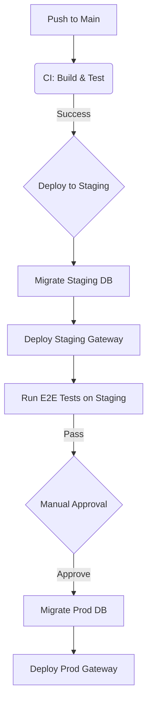

**Version**: 1.1

**Scope**: Staging and Production Environment Deployment

**Core Principles**: GitOps Driven, Atomic Deployment, Manual Approval Mechanism

## 1. Deployment Architecture Overview

Our deployment strategy utilizes a **Two-Stage Pipeline**. Merging code into the `main` branch automatically triggers the deployment process.



### Environment Definitions

|   |   |   |   |   |
|---|---|---|---|---|
|**Environment**|**Purpose**|**Database (Supabase)**|**Gateway (Cloudflare)**|**Deployment Trigger**|
|**Local**|Development & Debugging|Host Docker (`localhost`)|Local Worker (`env.local`)|`pnpm dev`|
|**Staging**|Integration Testing, Acceptance|Staging Project (Cloud)|Edge Worker (`env.staging`)|Git Push (`main`)|
|**Production**|Real User Traffic|Prod Project (Cloud)|Edge Worker (`env.production`)|**Manual Approval**|

## 2. Infrastructure Initialization (One-Time Setup)

Before the first deployment, the following resources must be manually created.

### 2.1 Supabase Initialization

Log in to the [Supabase Dashboard](https://supabase.com/dashboard "null") and create two independent projects:

1. **Orca Cloud Staging**
    
    - Record: `Reference ID` (e.g., `vqy...`), `DB Password`.
        
    - Action: In `Authentication -> URL Configuration`, set the Site URL to the Staging Gateway address (e.g., `https://staging-api.orcaslicer.com`).
        
2. **Orca Cloud Production**
    
    - Record: `Reference ID`, `DB Password`.
        
    - Action: Set the Site URL to the production gateway domain and note the Supabase project base URL `https://auth.orcaslicer.com`.
        

### 2.2 Cloudflare Initialization

Run the following commands in your development machine terminal to create the object storage buckets:

```shell
# Create storage buckets
wrangler r2 bucket create orca-assets-staging
wrangler r2 bucket create orca-assets-prod
```

### 2.3 GitHub Repository Configuration (Environments)

GitHub Environments provide deployment protection rules and environment-specific secrets.

#### Staging Environment

1. Go to GitHub Repo -> **Settings** -> **Environments**.

2. Click **New environment** -> Name it `staging`.

3. (Optional) Add branch protection to restrict deployments to `main` branch only.

4. Save.

#### Production Environment (Gatekeeper)

To implement "Production Manual Approval," configure the production environment with required reviewers:

1. Go to GitHub Repo -> **Settings** -> **Environments**.
    
2. Click **New environment** -> Name it `production`.
    
3. Check **Required reviewers** -> Add core developer accounts.

4. (Optional) Add **Wait timer** for additional safety margin before deployment proceeds.
    
5. Save.
    

## 3. Secrets Matrix

We need to configure secrets separately for **Cloudflare** (used by the application at runtime) and **GitHub** (used by CI deployment scripts).

### 3.1 Cloudflare Secrets (Runtime Keys)

_Purpose: Used by the Gateway to connect to the database and verify Chaos requests._

Run the following commands on your local development machine to upload secrets:

```shell
# === Staging ===
cd apps/gateway
# Enter the Service Role Key for the Staging Project
wrangler secret put SUPABASE_SERVICE_ROLE_KEY --env staging
# Enter the JWT secret for verifying Supabase-issued access tokens
wrangler secret put SUPABASE_JWT_SECRET --env staging
# Optional: if using anon key for client-originated calls
wrangler secret put SUPABASE_ANON_KEY --env staging
# Set a random secret for Chaos Testing
wrangler secret put CHAOS_SECRET --env staging 

# === Production ===
# Enter the Service Role Key for the Production Project
wrangler secret put SUPABASE_SERVICE_ROLE_KEY --env production
# Enter the JWT secret for verifying Supabase-issued access tokens
wrangler secret put SUPABASE_JWT_SECRET --env production
# Optional: if using anon key for client-originated calls
wrangler secret put SUPABASE_ANON_KEY --env production
```

### 3.2 GitHub Actions Secrets (Deployment Keys)

_Purpose: Used by CI scripts to execute database migrations and upload Worker code._

Add the following in GitHub Repo -> **Settings** -> **Secrets and variables** -> **Actions**:

|   |   |   |
|---|---|---|
|**Secret Name**|**Example Value**|**Description**|
|`CLOUDFLARE_API_TOKEN`|`ExampleToken...`|Requires Edit permissions for Workers and R2|
|`CLOUDFLARE_ACCOUNT_ID`|`c829...`|Cloudflare Account ID|
|`STAGING_DB_URL`|`postgresql://postgres:[pwd]@[ref].supabase.co:5432/postgres`|Direct connection string for Staging DB migration|
|`PROD_DB_URL`|`postgresql://postgres:[pwd]@[ref].supabase.co:5432/postgres`|Direct connection string for Prod DB migration|
|`STAGING_GATEWAY_BASE_URL`|`https://staging-api.orcaslicer.com`|Base URL for staging gateway (used by E2E tests)|
|`STAGING_SUPABASE_URL`|`https://xxx.supabase.co`|Base URL for staging Supabase project (used by E2E tests)|
|`STAGING_SUPABASE_ANON_KEY`|`eyJhbG...`|Staging Supabase anon key (used by E2E to create test sessions)|
|`STAGING_SUPABASE_SERVICE_ROLE_KEY`|`eyJhbG...`|Staging Supabase service role key (used by E2E to create/delete test users)|
|`STAGING_SUPABASE_JWT_SECRET`|`<long-random-string>`|Used by staging E2E token verification and staging gateway|
|`PROD_SUPABASE_JWT_SECRET`|`<long-random-string>`|Used by production gateway|

## 4. CI/CD Pipeline Configuration

Ref to the file `.github/workflows/deploy.yml` for the CI/CD pipeline configuration.

## 5. Standard Operating Procedures (SOP)

### Scenario A: Feature Release

1. **Develop**: Complete code and `migrations` locally, ensuring tests pass.
    
2. **Commit**: `git push origin main`.
    
3. **Wait**: GitHub Actions automatically deploys to Staging.
    
4. **Verify**: Receive GitHub notification "Deployment pending approval".
    
    - Manually verify the feature in the Staging environment.
        
    - (Optional) Run E2E test scripts against Staging.
        
5. **Approve**: Click "Review deployments" -> "Approve" on the GitHub Actions page.
    
6. **Launch**: The system automatically deploys to Production.
    

### Scenario B: Hotfix

1. If the issue is in the Gateway code layer: Modify code directly, Push, and follow the process above.
    
2. If the issue is in the Database layer (e.g., corrupted data):
    
    - **DO NOT manipulate the Prod database directly!**
        
    - Write a new Migration script to fix the data.
        
    - Follow the standard release process to apply this Migration.
        

### Scenario C: Rollback

Since database migrations are involved, a complete "One-Click Rollback" is unsafe. We adopt a **"Fix Forward"** strategy.

1. **Gateway Rollback**:
    
    - Cloudflare Dashboard -> Workers -> Deployments.
        
    - Find the previous version and click "Rollback". This restores code logic in seconds.
        
2. **Database Rollback**:
    
    - If a Migration caused the issue, you must write a new `revert_migration.sql` to undo the changes, then Push to deploy.
        

## 6. Launch Checklist

Before clicking "Approve" to deploy to Production for the first time, please confirm:

- [ ] **RLS Policies**: Confirm RLS is enabled on all User Data tables and policies are correct.
    
- [ ] **Indexes**: Confirm the `updated_at` field in the `profiles` table has an index (Critical for Sync performance).
    
- [ ] **WAF Rules**: Confirm Cloudflare WAF has rate-limiting rules configured for `/v1/sync`.
    
- [ ] **Auth Configuration**: Confirm the Prod Supabase JWT Secret matches the one configured in the Gateway (if manually rotated).
    
- [ ] **SMTP**: Confirm Prod Supabase email service is configured; otherwise, users will not receive confirmation emails.

- [ ] **Supabase URL**: Confirm `SUPABASE_URL` in the production Worker (wrangler) points to the custom domain `https://auth.orcaslicer.com` (covers Auth + REST).
